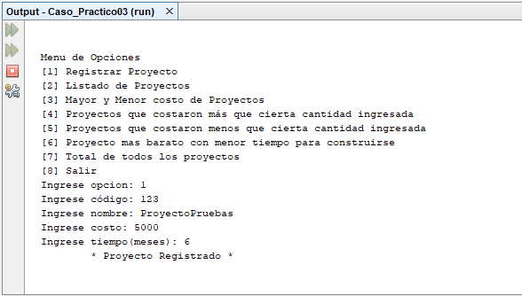

# gestion-proyectos
Sistema de gestión de proyectos que permite registrar un proyecto, listado de los proyectos, cual es el mayor y el menor precio de un proyecto, listado de los proyectos que costaron más que cierto monto, listado de los proyectos que costaron menos que cierto monto, proyecto más barato con el menor tiempo y el costo total de los proyectos, **08/11/19**.

<strong>Imagen:</strong> Menú principal - Registrar proyecto.

